# Знакомство с функционалом прототипа

Инструкция поможет вам познакомиться с будущим функционалом, который показан в [прототипе][1].



**Прототип в Figma — не рабочая версия продукта,** это иллюстрация того, как может быть отражена бизнес-логика. Прототип показывает, как будет выглядеть интерфейс, а также где, когда и после какого клика появляются страницы с определенной информацией. 



**В прототипе можно:** 
- познакомиться с экранами, окнами и навигацией в личном кабинете;
- увидеть, как меняется итнтерфейс в зависимости от роли;
- понять логику переходов между разделами.

**В прототипе нельзя:**
- вводить реальные данные;
- проверять скорость работы;
- проверять обработку ошибок и нештатных ситуаций.

## Главная страница

К личному кабинету есть доступ у пользователей с тремя ролями:
- **аккаунт-менеджер** — базовый доступ: может работать с заявками, документами поступления и списания, товарами и номенклатурой;
- **владелец бюджета** — всё, что доступно аккаунт-менеджеру, а также создание поручений и просмотр отчётов;
- **администратор** — всё, что доступно владельцу бюджета, а также добавление пользователей и настройка доступа к системе, брендам и отделам. 

В зависимости от роли отличается и главная страница пользователя. 

**Главная страница администратора** будет включать в себя:
1. список пользователей и их активность (рассчитывается относительно количества созданных и обработанных заявок);
2. информацию о действующем договоре; 
3. все созданные поручения.
*Каждый из элементов главной страницы кликабельный: можно протестировать в прототипе и и посмотреть детальную информацию по каждому элементу.* 

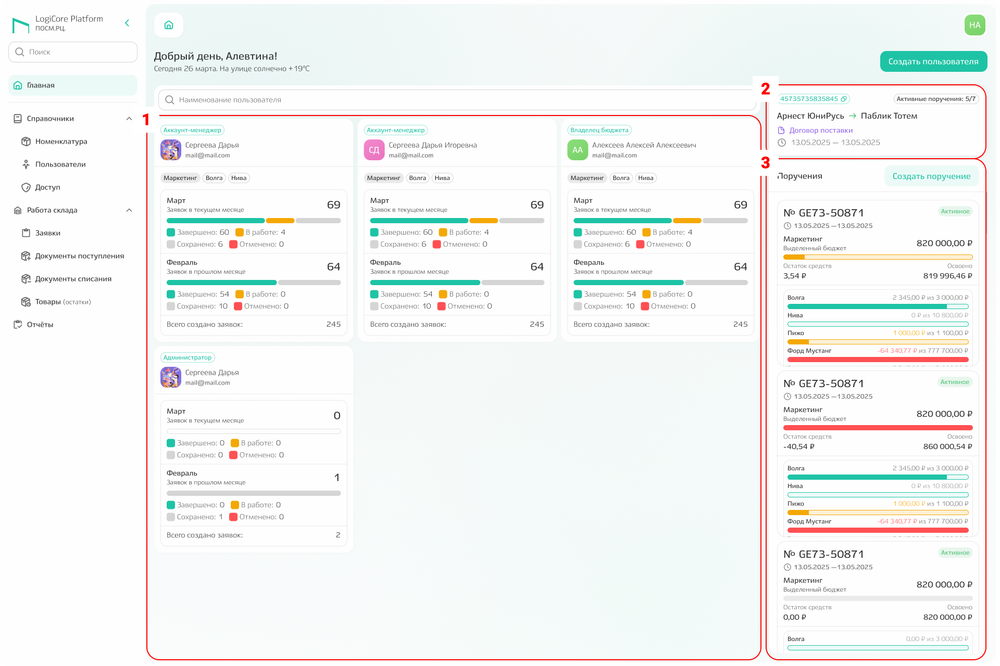{.center width=1200}

**Главная страница владельца бюджета** будет включать в себя: 
1. поручения, созданные самим пользователем;
2. заявки, созданные в рамках этих поручений. 
*Главная страница владельца бюджета не реализована в прототипе, но аналогичный функционал рассмотрен для администратора*.

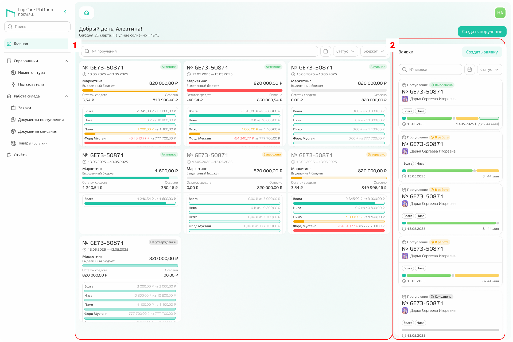{.center width=1200}

**Главная страница аккаунт-менеджера** будет включать в себя:
1. заявки, созданные самим пользователем, с графическим отображением текущего этапа выполнения;
2. поручения, в рамках которых текущему пользователю можно создавать заявки. 
*Главная страница аккаунт-менеджера не реализована в прототипе, но аналогичный функционал рассмотрен для администратора*.

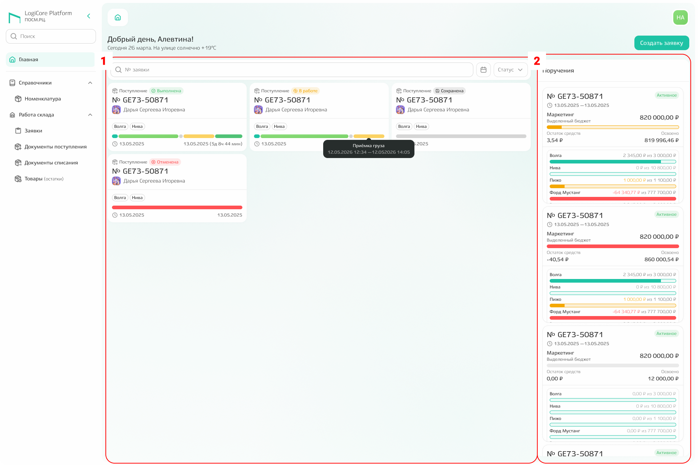{.center width=1200}

## Работа в подсистемах

Функционал распределён по подсистемам, которые находятся в боковом меню. При клике на «LogiCore Platform» состав бокового меню будет меняться и отображать список доступных подсистем разных ролей.

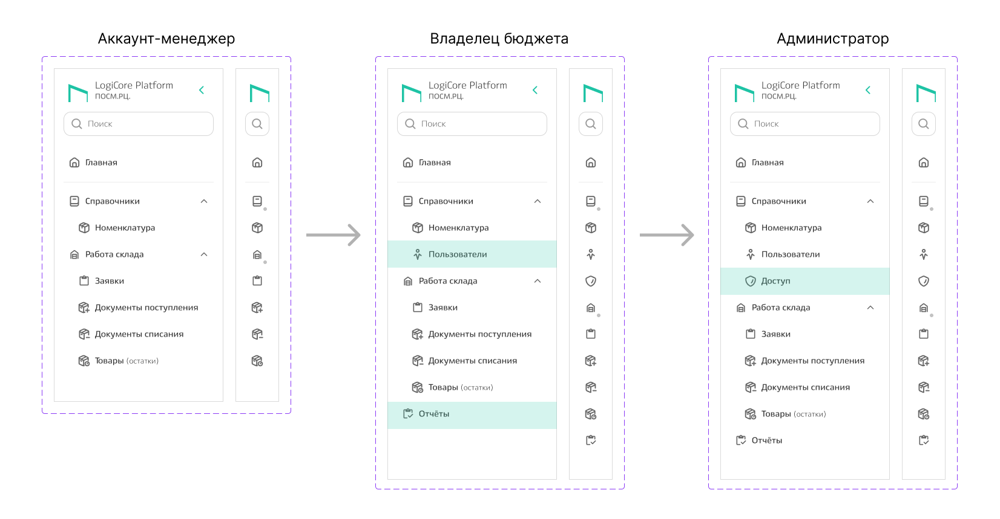{.center width=1200}



В инструкции будет описан **интерфейс администратора** — как наиболее полный.
*Ниже для каждой подсистемы сделана пометка о том, у каких ролей есть доступ к той или иной функциональности.*  



### 1. Номенклатура

В боковом меню кликните по подсистеме «Номенклатура», будет открыта страница, которую увидит пользователь при первом входе в систему, когда еще никакая номенклатура не добавлена. 

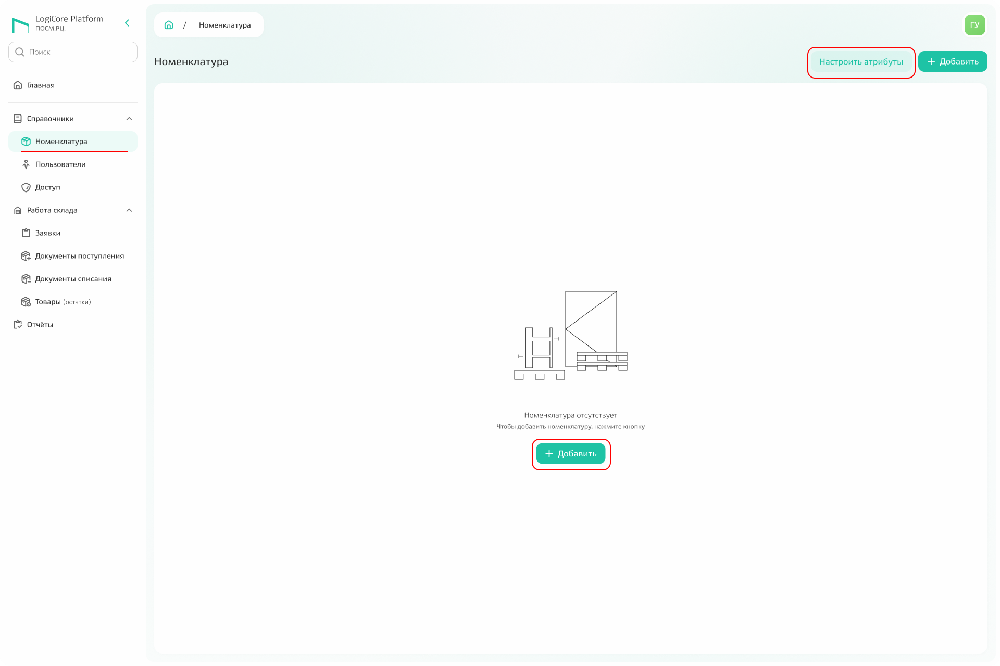{.center width=1200}

В интерфейсе будут активны переходы по командам «Добавить» и «Настроить атрибуты». 

#### Добавление и редактирование номенклатуры 

**Доступ**: у аккаунт-менеджера, владельца бюджета и администратора 

**Команда «Добавить»** необходима для того, чтобы добавить новую номенклатуру. По клику будет открыта страница, где отражен примерный состав полей для добавляемой номенклатуры. Чтобы продолжить, необходимо кликнуть на зону загрузки файлов или фото. 

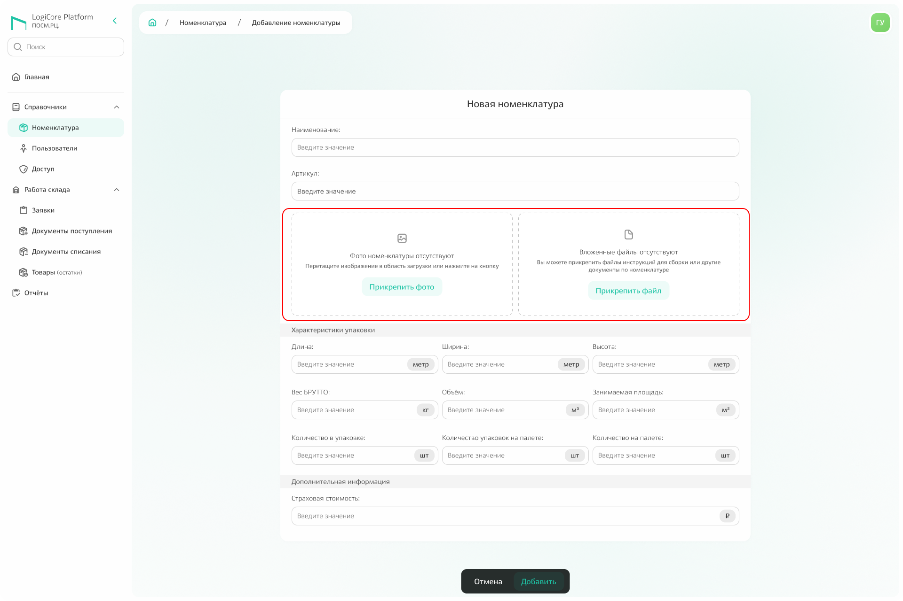{.center width=1200}

Будет отображена симуляция того, как будет выглядеть загрузка фото или файлов при перетаскивании файлов в область загрузки. При клике по команде «Добавить» или по любой из областей загрузки будет открыта частично заполненная карточка номенклатуры. Для продолжения работы необходимо кликнуть по команде «Сохранить». 

*В реальном продукте сохранить карточку такой номенклатуры не получится, так как большинство из обязательных полей (например, длина, ширина или высота) не заполнено.*

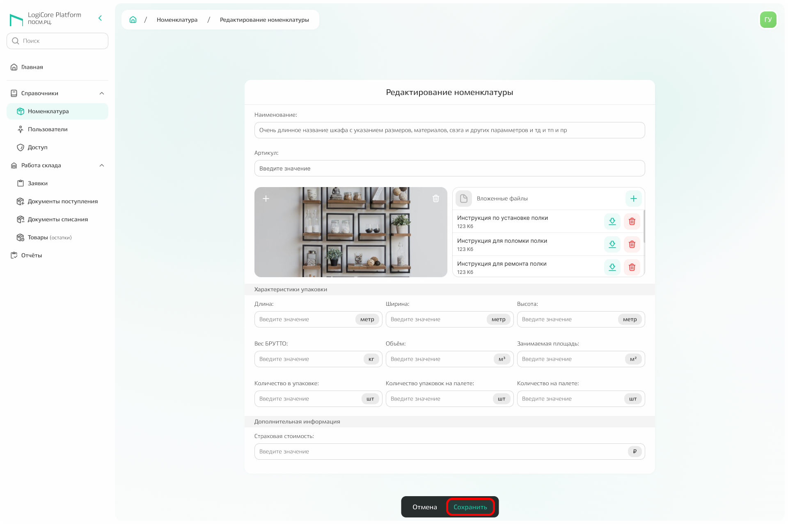{.center width=1200}

Будет отображена страница со списком номенклатуры, но уже не пустая, а содержащая некоторый перечень добавленной номенклатуры.

*Одна строка в списке — одна карточка номенклатуры. Чтобы в реальном продукте отобразилось три позиции, нужно повторить шаги по добавлению три раза. Но это прототип: он показывает последовательность действий и логику, а не предназначен для реальной работы.*

В списке номенклатуры кликните по строке, чтобы открыть карточку с информацией о товаре. При необходимости нажмите «Редактировать» — внести изменения можно прямо из карточки.

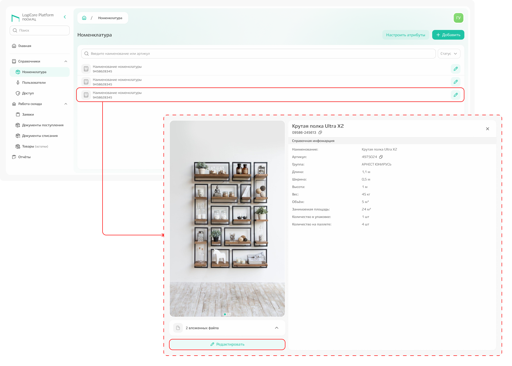{.center width=1200}

При клике по команде «Редактировать» откроется окно с данными из карточки. В реальном продукте все поля доступны для изменений. В прототипе можно только нажать «Сохранить» — это имитация сохранения измений в базу данных. 

К окну редактирования номенклатуры можно также перейти сразу из списка номенклатуры по иконке редактирования. 

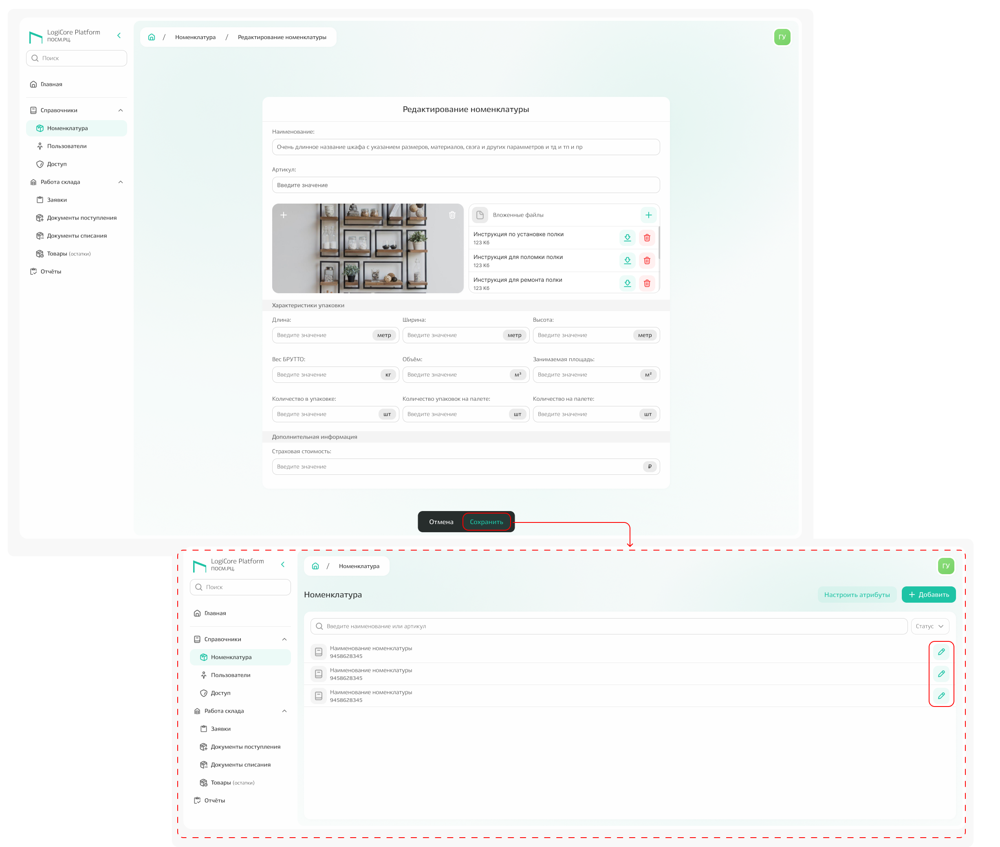{.center width=1200}

#### Добавление и редактирование атрибутов

**Доступ**: только у администратора 

**Атрибут** — это поле, которое описывает некоторую характеристику номенклатуры. 
Администратор может:
- добавить новые значения для существующих атрибутов (полей);
- изменить или удалить старые значения существующих атрибутов;
- добавить новые атрибуты (поля), которые будут заполняться в карточке каждой номенклатуры. 



Значение добавляемых полей (атрибутов) **всегда** выбирается из некоторого списка значений, который может менять только администратор.



**Как настроить атрибуты:**
1. По команде «Настроить атрибуты» откроется для изменения состава полей номенклатуры.
2. Доступны три команды: «Отмена», «Сохранить» и иконка закрытия (×). В прототипе все три команды работают одинаково — закрывают окно. 
В реальном продукте:
- «Сохранить» — записывает изменения в базу данных;
- «Отмена» и «×» — закрывают окно без сохранения.

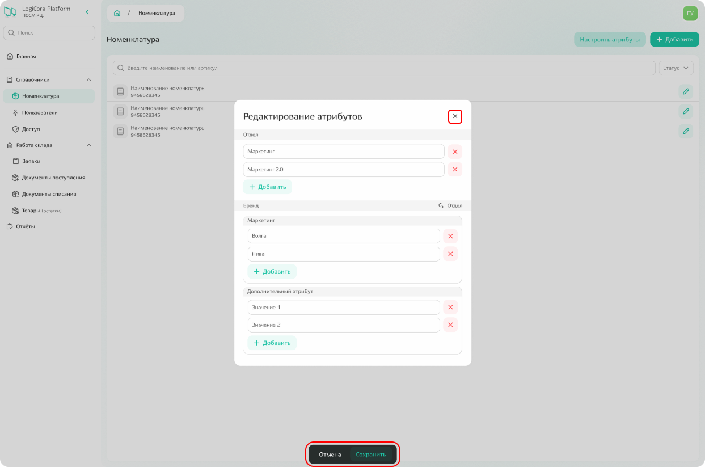{.center width=1200}

Также в прототипе неактивна команда «Добавить». В реальном продукте она позволяет добавлять новые атрибуты (поля) для заполнения в каждой карточке при создании новой номенклатуры. 

Чтобы выйти из подсистемы «Номенклатура» и вернуться на главную страницу нажмите на подсистему «Главная» в боковом меню или на иконку домашней страницы в «хлебных крошках».

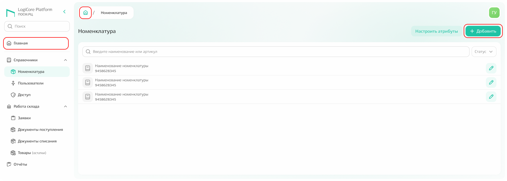{.center width=1200}

### 2. Пользователи

**Доступ:** работа в разделе пользователей доступна только для администратора

Для перехода к подсистеме «Пользователи» необходимо кликнуть по одноименной подсистеме в боковом меню. Откроется страница со списком карточек всех пользователей, добавленных в систему. 

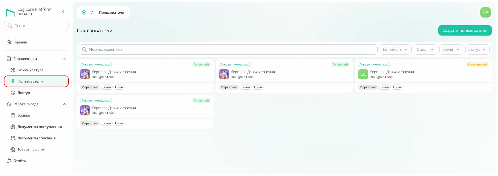{.center width=1200}

#### Добавление нового пользователя

Нажмите «Создать пользователя» — откроется модальное окно. 
Кликните по полю «Электронная почта» — подставится предзаполненное значение.
Затем нажмите «Продолжить» для перехода к заполнению основных данных, а после ещё раз «Продолжить», чтобы заполнить поля формы и перейти к следующему модальному окну.

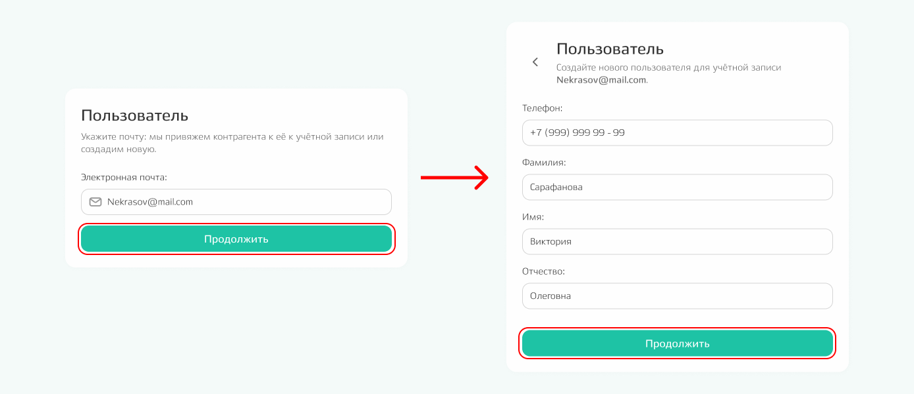{.center width=1200}

В следующем окне необходимо выбрать уровень доступа в системе (роль пользователя).

**Администратор**
Выберите должность «Администратор» и нажмите «Создать пользователя». Система выведет уведомление об успешном создании.
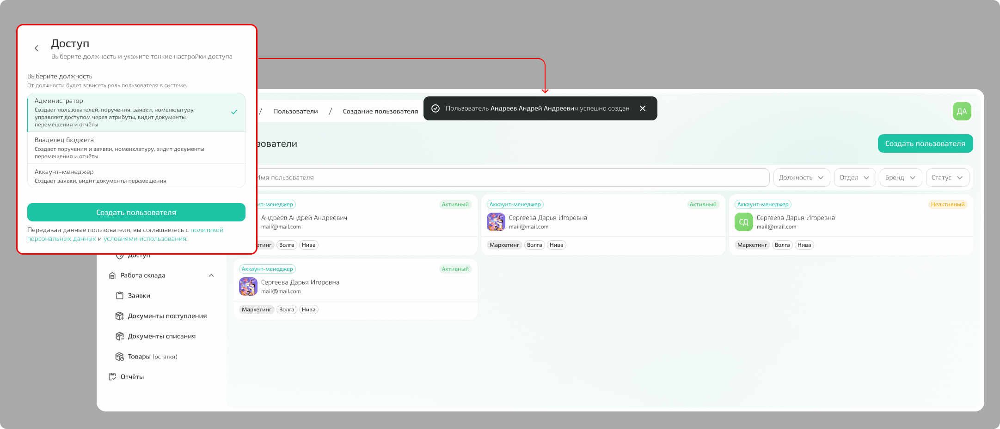{.center width=1200}

**Владелец бюджета**
Пройдите ту же цепочку: «Создать пользователя» → ввод email → заполнение основных данных → «Продолжить».



В прототипе нужно сначала выбрать «Администратор», затем «Владелец бюджета». Это ограничение прототипа. В реальном продукте можно выбрать нужную роль сразу.



Выберите должность «Владелец бюджета» и нажмите «Выбрать» для поля «Отдел». Автоматически подтянется отдел «Маркетинг» (в реальном продукте можно выбрать любой отдел из списка).

Затем нажмите «Выбрать» для поля «Бренд», кликните в любом месте открывшегося окна со списком, добавьте бренд и нажмите «Создать пользователя».

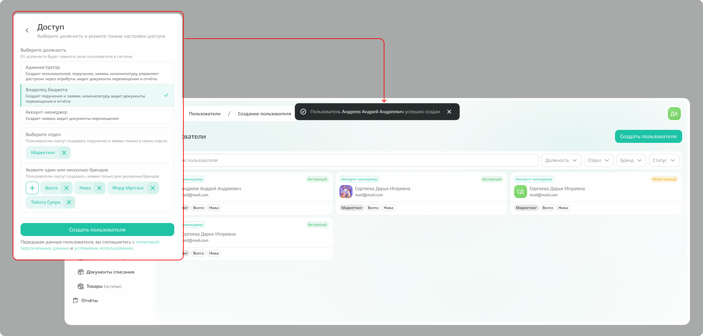{.center width=1200}



Отдел и бренд указываются только для ролей «Аккаунт-менеджер» и «Владелец бюджета». У администратора есть доступ ко всем брендам и отделам, поэтому этот шаг для него пропускается.



#### Просмотр информации о пользователе



Если вы только что создали пользователя, снова нажмите на подсистему «Пользователи» в боковом меню. Это необходимо для того, чтобы в прототипе стали доступны редактирование и деактивация. В реальном продукте этот шаг не требуется.



Чтобы открыть информацию о пользователе, кликните по его карточке в списке. В прототипе доступна только Сергеева Дарья Игоревна.

При клике откроется сайдбар с информацией:
1. основные данные (ФИО, статус, телефон, email, должность, отдел, бренд);
2. активность пользователя за всё время в системе;
3. иконки редактирования и деактивации пользователя.

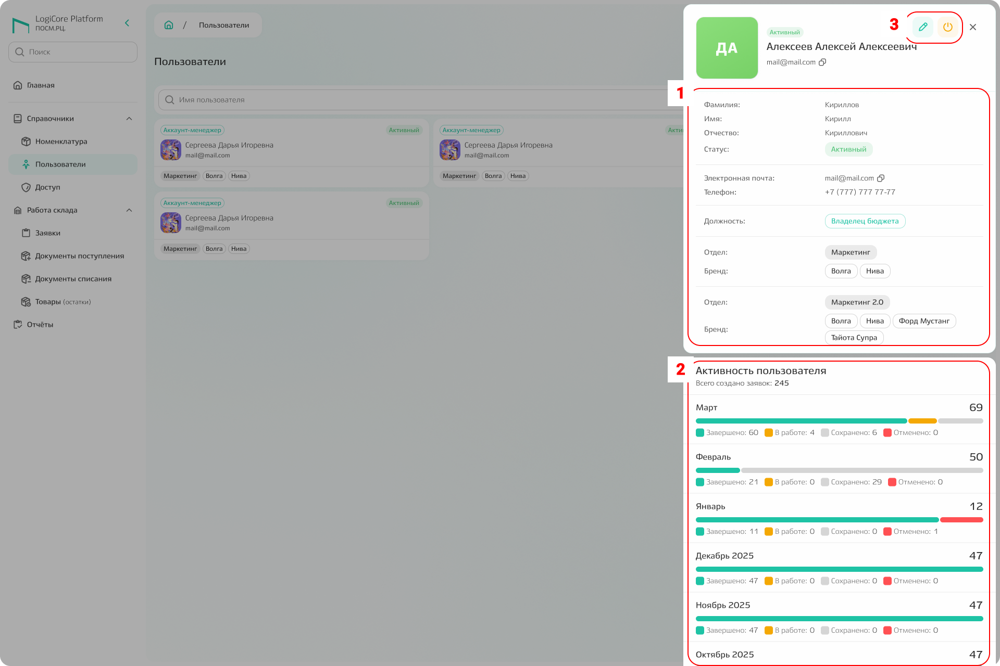{.center width=1200}

#### Редактирование информации о пользователе

Нажмите на иконку редактирования в сайдбаре — откроется модальное окно с полями для редактирования.
- «×» — закрыть окно без сохранения;
- «Сохранить» — применить изменения. В интерфейсе появится уведомление об успешном сохранении.

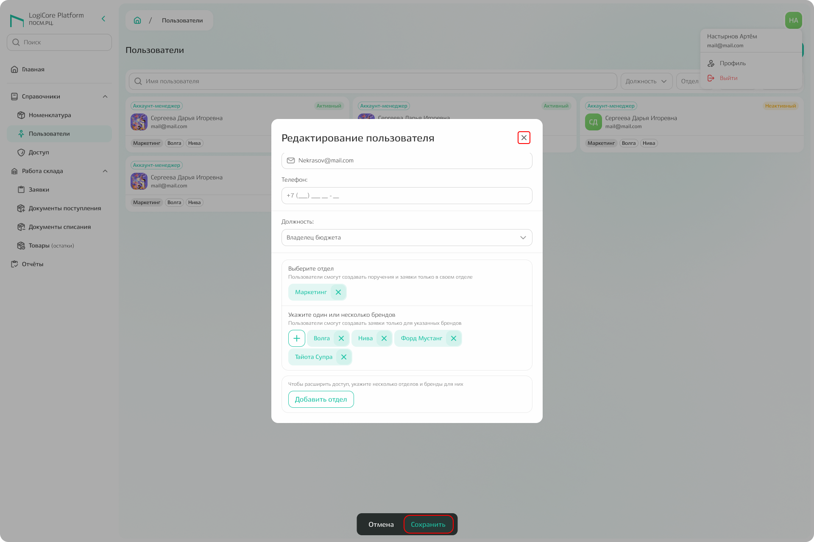{.center width=1200}

#### Деактивация пользователя

Деактивация — аналог удаления в системе. Пользователя нельзя удалить полностью, можно только сделать неактивным:
1. Нажмите на иконку деактивации;
2. Подтвердите действие в модальном окне.
*Клик в любом месте модального окна в прототипе приведет к деактивации пользователя. В реальном продукте команды «Отмена» и «х» приведут к отмене деактивации и только команда «Деактивировать» сделает пользователя неактивным*.

Далее попробуйте ативировать пользователя по той же самой иконке. 

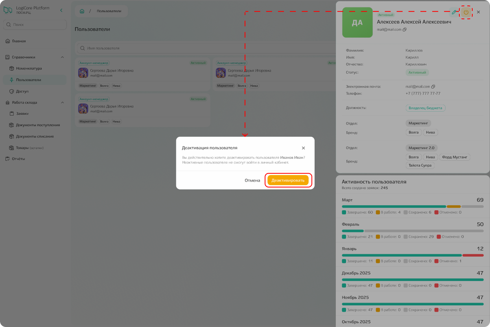{.center width=1200}

Чтобы выйти из подсистемы «Пользователи» и вернуться на главную страницу нажмите на подсистему «Главная» в боковом меню или на иконку домашней страницы в «хлебных крошках».

### 3. Доступ

### 4. Заявки

### 5. Документы поступления

### 6. Документы списания

### 7. Товары

### 8. Отчёты

[1]: https://www.figma.com/proto/XizxvF7dcb5KLfk3ofVy4j/%D0%AE%D0%BD%D0%B8%D0%BB%D0%B5%D0%B2%D0%B5%D1%80?node-id=153-30158&p=f&t=1IHssR2KXpRVOBiC-0&scaling=min-zoom&content-scaling=fixed&page-id=0%3A1&starting-point-node-id=153%3A30158&show-proto-sidebar=1