# Знакомство с функционалом прототипа

Инструкция поможет вам познакомиться с будущим функционалом, который показан в [прототипе][1].



**Прототип в Figma — не рабочая версия продукта,** это иллюстрация того, как может быть отражена бизнес-логика. Прототип показывает, как будет выглядеть интерфейс, а также где, когда и после какого клика появляются страницы с определенной информацией. 



**В прототипе можно:** 
- познакомиться с экранами, окнами и навигацией в личном кабинете;
- увидеть, как меняется итнтерфейс в зависимости от роли;
- понять логику переходов между разделами.

**В прототипе нельзя:**
- вводить реальные данные;
- проверять скорость работы;
- проверять обработку ошибок и нештатных ситуаций.

## Главная страница 

К личному кабинету есть доступ у пользователей с тремя ролями:
- **аккаунт-менеджер** — базовый доступ: может работать с заявками, документами поступления и списания, товарами и номенклатурой;
- **владелец бюджета** — всё, что доступно аккаунт-менеджеру, а также создание поручений и просмотр отчётов;
- **администратор** — всё, что доступно владельцу бюджета, а также добавление пользователей и настройка доступа к системе, брендам и отделам. 

Кроме того, в зависимости от роли отличается и главная страница пользователя.

### Главная страница аккаунт-менеджера
Главная страница аккаунт-менеджера будет включать в себя:
1. **заявки**, созданные самим пользователем, с графическим отображением текущего этапа выполнения;
2. **поручения**, в рамках которых текущему пользователю можно создавать заявки. 
*Главная страница аккаунт-менеджера не реализована в прототипе, но доступный для аккаунт-менеджера функционал рассмотрен для администратора*.

{.center width=1200}

### Главная страница владельца бюджета
Главная страница владельца бюджета будет включать в себя: 
1. **поручения**, созданные самим пользователем;
2. **заявки**, созданные в рамках этих поручений. 
*Главная страница владельца бюджета не реализована в прототипе, но доступный для владельца бюджета функционал рассмотрен для администратора*.

{.center width=1200}

### Главная страница администратора
Главная страница администратора будет включать в себя:
1. **список пользователей** и их активность (рассчитывается относительно количества созданных и обработанных заявок);
2. информацию о действующем **договоре**; 
3. все созданные **поручения**.

{.center width=1200}

#### Создание поручения
С главной страницы администратора или владельца бюджета нажмите «Создать поручение». Откроется модальное окно, в котором необходимо кликнуть по области загрузки файлов.

Отобразится интерфейс, имитирующий загрузку. Нажмите в любом месте области загрузки.

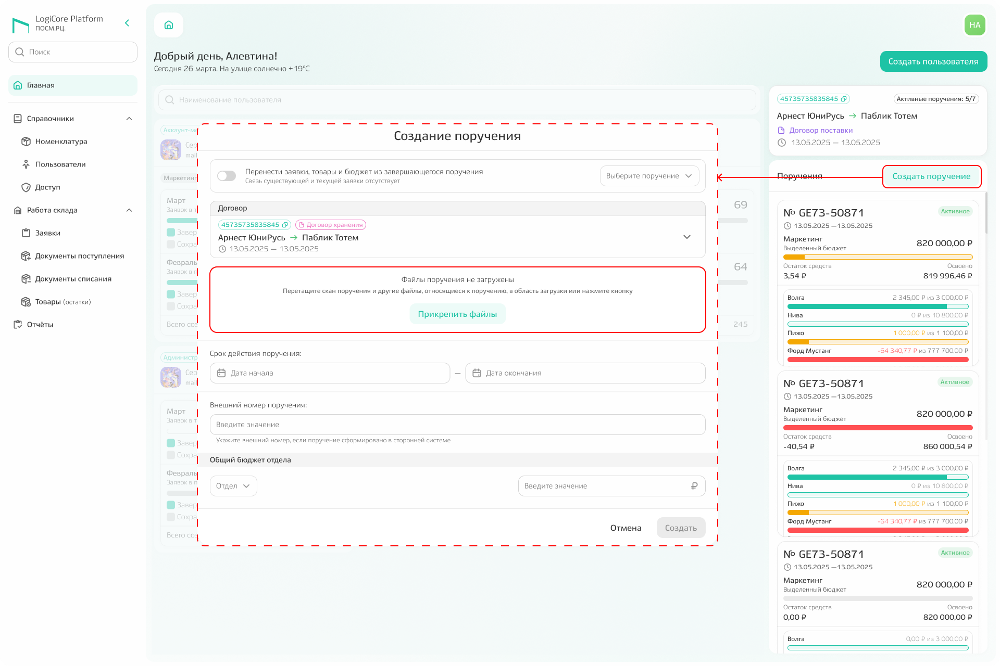{.center width=1200}

В модальном окне уже заполнен общий бюджет и сумма общего бюджета по распределена по брендам. В реальном продукте данные вносятся вручную (в процентах или денежном эквиваленте). 

Также в прототипе и в реальном продукте можно удалить ненужные бренды из поручения — нажмите на иконку удаления напротив названия бренда. После удаления появится сообщение, что этот бренд нельзя будет указать в заявках, созданных на основании данного поручения.

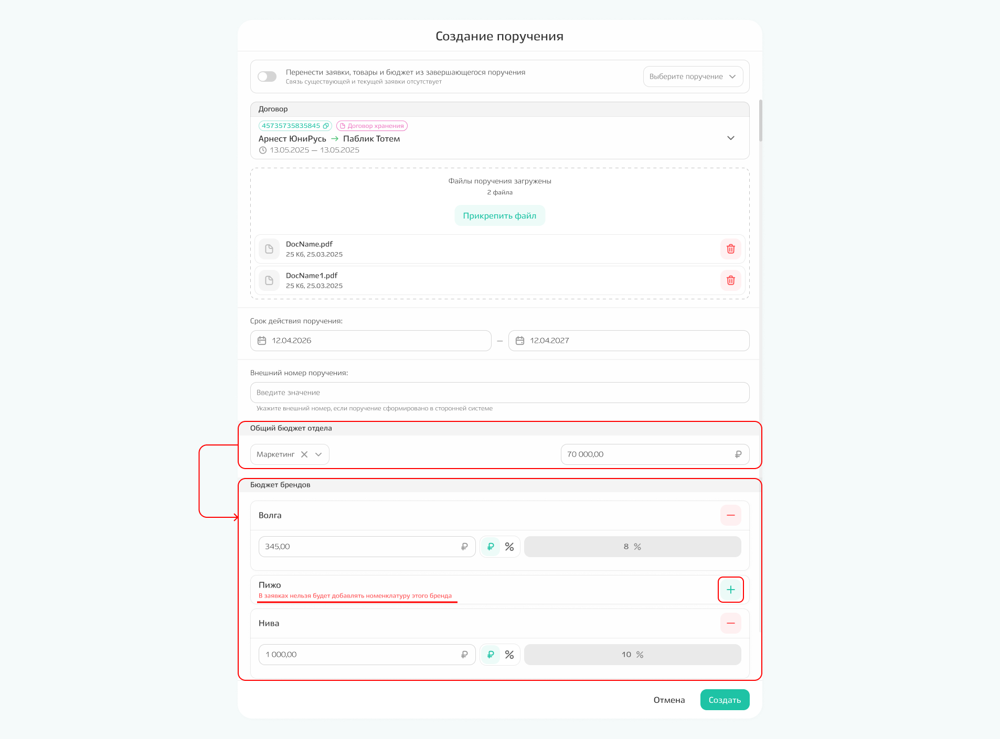{.center width=1200}

Нажмите «Создать» — откроется окно со списком поручений. 



Страница с поручениями отличается от стартовой страницы администратора. Это ограничение прототипа. В реальном продукте возврат будет происходить на главную страницу. 



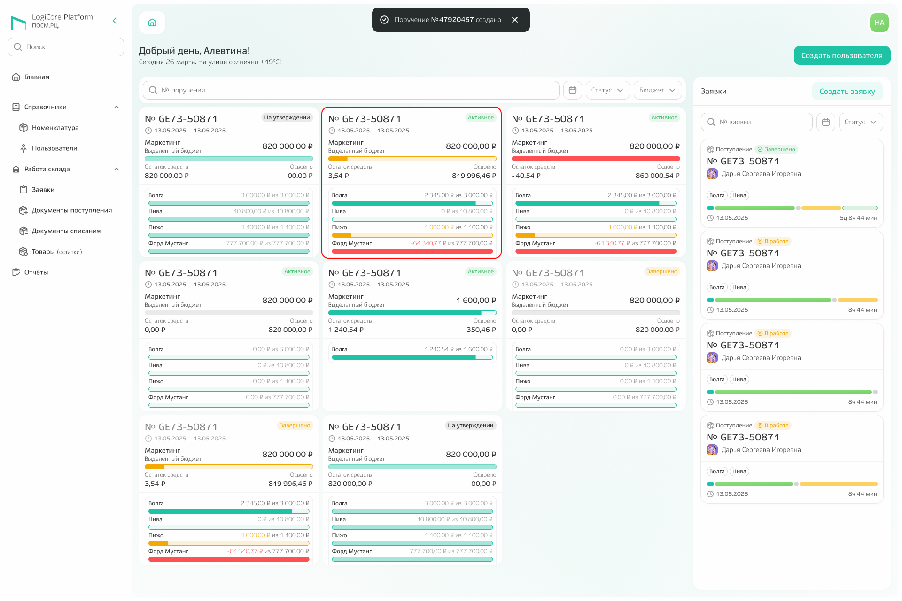{.center width=1200}

#### Просмотр информации о поручении
Кликните по существующему поручению — откроется модальное окно с подробной информацией. 
Там можно открыть информацию о заказчике, а также посмотреть соотношение потраченных и неизрасходованных средств по бюджету.Для этого кликните по диаграмме или по конкретному бренду. 
Яркие цвета означают нерастраченный остаток, чуть более блеклые — потраченный бюджет.

Кроме того, из таблицы модального окна товаров можно перейти к карточке товара из складского учёта.

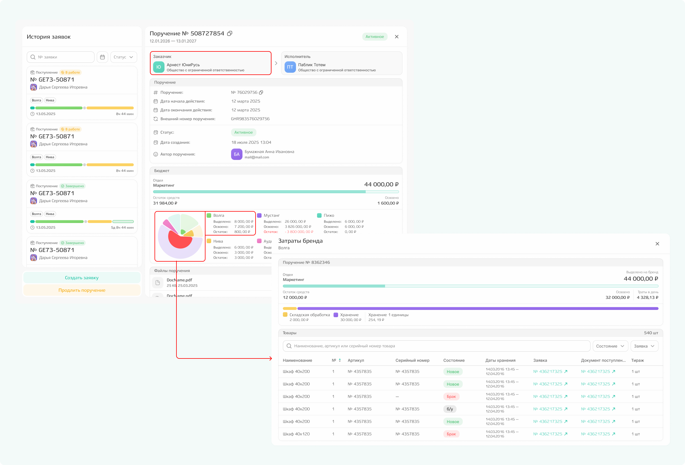{.center width=1200}

#### Продление поручения



Для того, чтобы познакомиться с функционалом продления поручения необходимо перейти в подсистему «Главная» в боковом меню и кликнуть по команде «Создать поручение».



В модальном окне создания поручения кликните по области со свитчером переноса заявок, товаров и бюджетов из завершающегося поручения.

В прототипе свитчер включится, и автоматически выберется поручение, которое скоро закончит срок действия. Все товары, заявки и бюджеты из этого поручения будут перенесены на новое. В реальном продукте поручение, срок которого истекает, нужно будет выбрать вручную.

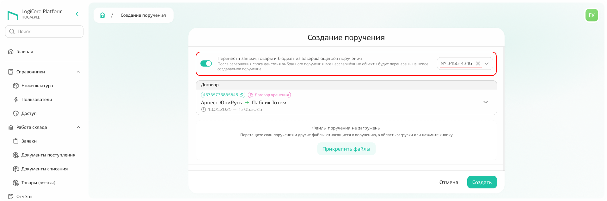{.center width=1200}



Если сумма завершающегося поручения была или будет в минусе, то при создании поручения, на которое переносятся остатки, нельзя ввести бюджет меньше той суммы, что ушла в минус. 



#### Управление пользователями
С главной страницы можно просмотреть информацию о пользователе из карточки, отредактировать её, деактивировать пользователя или создать нового по команде «Создать пользователя». 
Алгоритм работы с пользователями описан в разделе «Пользователи».

#### Договор и поручения
Просмотрите информацию о действующем договоре в модальном окне и при необходимости создайте поручение на основании договора. 

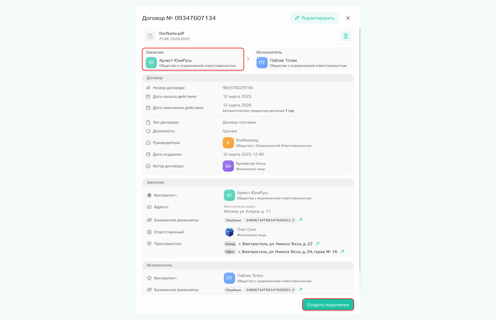{.center width=1200}

## Работа в подсистемах

Функционал распределён по подсистемам, которые находятся в боковом меню. При клике на «LogiCore Platform» состав бокового меню будет меняться и отображать список доступных подсистем разных ролей.

{.center width=1200}



В инструкции будет описан **интерфейс администратора** — как наиболее полный.
*Ниже для каждой подсистемы сделана пометка о том, у каких ролей есть доступ к той или иной функциональности.*  



### 1. Номенклатура

В боковом меню кликните по подсистеме «Номенклатура», будет открыта страница, которую увидит пользователь при первом входе в систему, когда еще никакая номенклатура не добавлена. 

{.center width=1200}

В интерфейсе будут активны переходы по командам «Добавить» и «Настроить атрибуты». 

#### Добавление и редактирование номенклатуры 

**Доступ**: у аккаунт-менеджера, владельца бюджета и администратора 

**Команда «Добавить»** необходима для того, чтобы добавить новую номенклатуру. По клику будет открыта страница, где отражен примерный состав полей для добавляемой номенклатуры. Чтобы продолжить, необходимо кликнуть на зону загрузки файлов или фото. 

{.center width=1200}

Будет отображена симуляция того, как будет выглядеть загрузка фото или файлов при перетаскивании файлов в область загрузки. При клике по команде «Добавить» или по любой из областей загрузки будет открыта частично заполненная карточка номенклатуры. Для продолжения работы необходимо кликнуть по команде «Сохранить». 

*В реальном продукте сохранить карточку такой номенклатуры не получится, так как большинство из обязательных полей (например, длина, ширина или высота) не заполнено.*

{.center width=1200}

Будет отображена страница со списком номенклатуры, но уже не пустая, а содержащая некоторый перечень добавленной номенклатуры.

*Одна строка в списке — одна карточка номенклатуры. Чтобы в реальном продукте отобразилось три позиции, нужно повторить шаги по добавлению три раза. Но это прототип: он показывает последовательность действий и логику, а не предназначен для реальной работы.*

В списке номенклатуры кликните по строке, чтобы открыть карточку с информацией о товаре. При необходимости нажмите «Редактировать» — внести изменения можно прямо из карточки.

{.center width=1200}

При клике по команде «Редактировать» откроется окно с данными из карточки. В реальном продукте все поля доступны для изменений. В прототипе можно только нажать «Сохранить» — это имитация сохранения измений в базу данных. 

К окну редактирования номенклатуры можно также перейти сразу из списка номенклатуры по иконке редактирования. 

{.center width=1200}

#### Добавление и редактирование атрибутов

**Доступ**: только у администратора 

**Атрибут** — это поле, которое описывает некоторую характеристику номенклатуры. 
Администратор может:
- добавить новые значения для существующих атрибутов (полей);
- изменить или удалить старые значения существующих атрибутов;
- добавить новые атрибуты (поля), которые будут заполняться в карточке каждой номенклатуры. 



Значение добавляемых полей (атрибутов) **всегда** выбирается из некоторого списка значений, который может менять только администратор.



**Как настроить атрибуты:**
1. По команде «Настроить атрибуты» откроется для изменения состава полей номенклатуры.
2. Доступны три команды: «Отмена», «Сохранить» и иконка закрытия (×). В прототипе все три команды работают одинаково — закрывают окно. 
В реальном продукте:
- «Сохранить» — записывает изменения в базу данных;
- «Отмена» и «×» — закрывают окно без сохранения.

{.center width=1200}

Также в прототипе неактивна команда «Добавить». В реальном продукте она позволяет добавлять новые атрибуты (поля) для заполнения в каждой карточке при создании новой номенклатуры. 

Чтобы выйти из подсистемы «Номенклатура» и вернуться на главную страницу нажмите на подсистему «Главная» в боковом меню или на иконку домашней страницы в «хлебных крошках».

{.center width=1200}

### 2. Пользователи

**Доступ:** работа в разделе пользователей доступна только для администратора

Для перехода к подсистеме «Пользователи» необходимо кликнуть по одноименной подсистеме в боковом меню. Откроется страница со списком карточек всех пользователей, добавленных в систему. 

{.center width=1200}

#### Добавление нового пользователя

Нажмите «Создать пользователя» — откроется модальное окно. 
Кликните по полю «Электронная почта» — подставится предзаполненное значение.
Затем нажмите «Продолжить» для перехода к заполнению основных данных, а после ещё раз «Продолжить», чтобы заполнить поля формы и перейти к следующему модальному окну.

{.center width=1200}

В следующем окне необходимо выбрать уровень доступа в системе (роль пользователя).

**Администратор**
Выберите должность «Администратор» и нажмите «Создать пользователя». Система выведет уведомление об успешном создании.
{.center width=1200}

**Владелец бюджета**
Пройдите ту же цепочку: «Создать пользователя» → ввод email → заполнение основных данных → «Продолжить».



В прототипе нужно сначала выбрать «Администратор», затем «Владелец бюджета». Это ограничение прототипа. В реальном продукте можно выбрать нужную роль сразу.



Выберите должность «Владелец бюджета» и нажмите «Выбрать» для поля «Отдел». Автоматически подтянется отдел «Маркетинг» (в реальном продукте можно выбрать любой отдел из списка).

Затем нажмите «Выбрать» для поля «Бренд», кликните в любом месте открывшегося окна со списком, добавьте бренд и нажмите «Создать пользователя».

{.center width=1200}



Отдел и бренд указываются только для ролей «Аккаунт-менеджер» и «Владелец бюджета». У администратора есть доступ ко всем брендам и отделам, поэтому этот шаг для него пропускается.



#### Просмотр информации о пользователе



Если вы только что создали пользователя, снова нажмите на подсистему «Пользователи» в боковом меню. Это необходимо для того, чтобы в прототипе стали доступны редактирование и деактивация. В реальном продукте этот шаг не требуется.



Чтобы открыть информацию о пользователе, кликните по его карточке в списке. В прототипе доступна только Сергеева Дарья Игоревна.

При клике откроется сайдбар с информацией:
1. основные данные (ФИО, статус, телефон, email, должность, отдел, бренд);
2. активность пользователя за всё время в системе;
3. иконки редактирования и деактивации пользователя.

{.center width=1200}

#### Редактирование информации о пользователе

Нажмите на иконку редактирования в сайдбаре — откроется модальное окно с полями для редактирования.
- «×» — закрыть окно без сохранения;
- «Сохранить» — применить изменения. В интерфейсе появится уведомление об успешном сохранении.

{.center width=1200}

#### Деактивация пользователя

Деактивация — аналог удаления в системе. Пользователя нельзя удалить полностью, можно только сделать неактивным:
1. Нажмите на иконку деактивации;
2. Подтвердите действие в модальном окне.
*Клик в любом месте модального окна в прототипе приведет к деактивации пользователя. В реальном продукте команды «Отмена» и «х» приведут к отмене деактивации и только команда «Деактивировать» сделает пользователя неактивным*.

Далее попробуйте ативировать пользователя по той же самой иконке. 

{.center width=1200}

Чтобы выйти из подсистемы «Пользователи» и вернуться на главную страницу нажмите на подсистему «Главная» в боковом меню или на иконку домашней страницы в «хлебных крошках».

### 3. Доступ

**Доступ:** только у администратора

**В прототипе этот раздел не реализован,** но в реальном продукте он будет представлен в виде графа связей между пользователями, отделами и брендами.

**Как работает граф связей:**
- Клик по вершине графа — подсвечиваются все связи с другими вершинами, появляется иконка редактирования.
- Иконка редактирования — открывает модальное окно, где можно настроить:
*для пользователя:* доступ к брендам и принадлежность к отделу;
*для бренда или отдела:* список связанных пользователей.

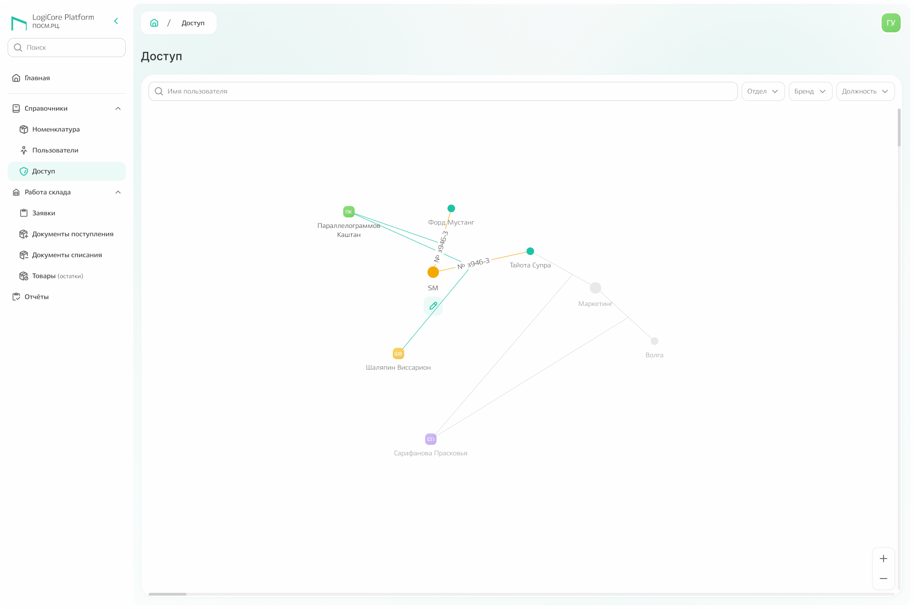{.center width=1200}

### 4. Заявки

**Доступ:** у аккаунт-менеджера, владельца бюджета и администратора

#### Создание заявки

На странице со списком заявок нажмите «Создать заявку». 

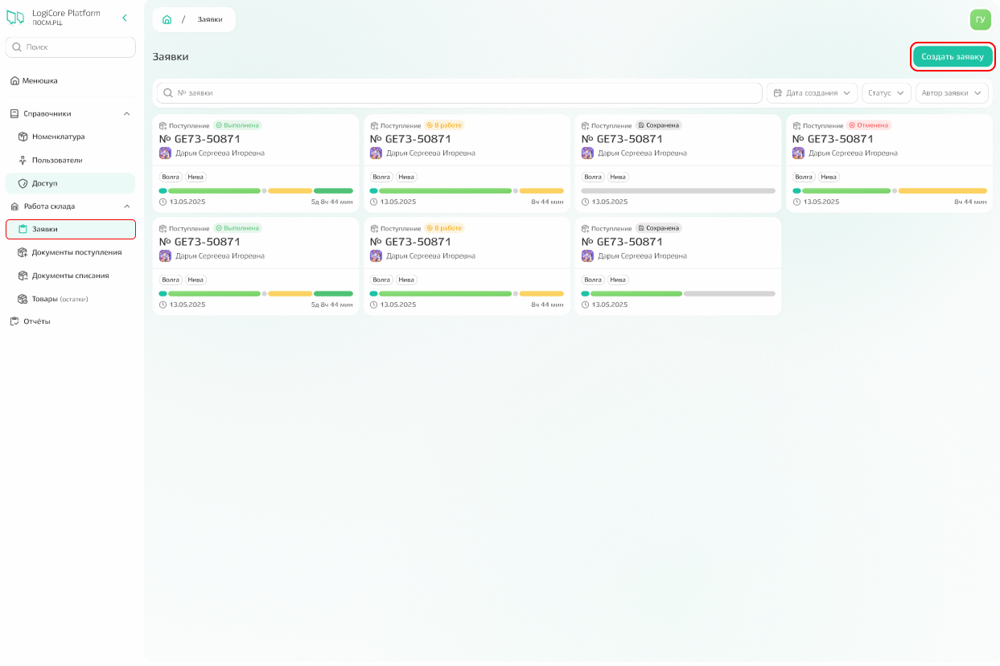{.center width=1200}

**Заполнение информации на вкладке «Основное»**
В открывшемся модальном окне можно переключать тип заявки между «Поступление» и «Списание» — поля формы будут меняться. 

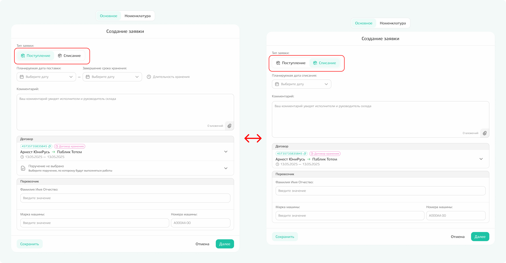{.center width=1200}

Выберите снова «Поступление» и кликните в области выбора договора и поручения. В прототипе поля заполнятся автоматически, тогда как в реальном продукте все поля нужно заполнять вручную. 
А после кликните по команде «Сохранить» — в прототипе появится уведомление о скором расходовании бюджета. В реальном продукте это уведомление появляется сразу, без нажатия.

Так как тип заявки менялся, информация на вкладке «Номенклатура» не сохранится. Нажмите «Далее», чтобы перейти к заполнению номенклатуры.

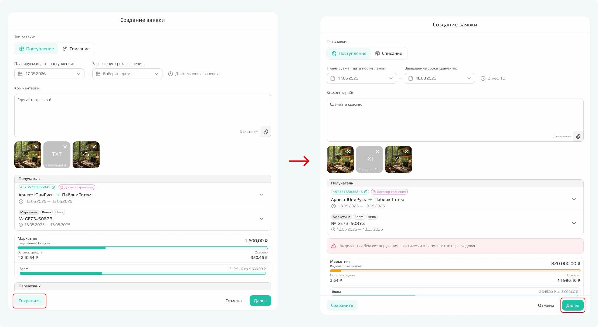{.center width=1200}

**Заполнение информации на вкладке «Номенклатура»**
В прототипе кликните по поисковой строке для имитации поиска, затем нажмите на вторую строчку в выпадающем списке, чтобы добавить номенклатуру. 
Будет открыто модальное окно с информацией, которую необходимо заполнить, чтобы номенклатура была добавлена.

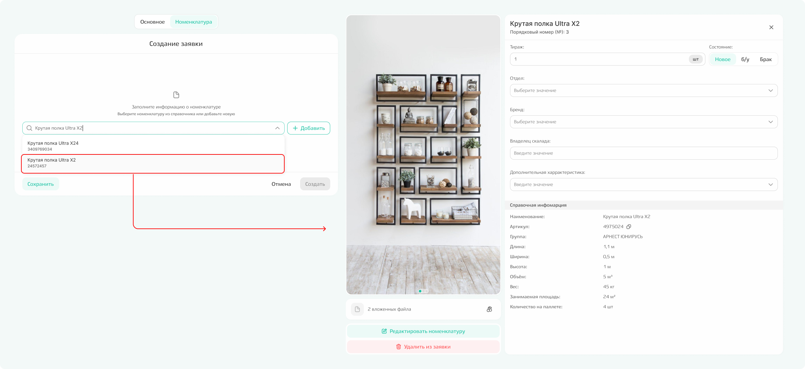{.center width=1200}

В реальном продукте необходимо заполнить поле «Тираж» (количество), указать состояние (новое, б/у или брак), при необходимости отредактировать карточку или удалить номенклатуру из заявки. 

В прототипе команды «Отмена» и «×» работают так же, как «Сохранить» — номенклатура добавляется. В реальном продукте они закрывают окно без добавления. 

Кроме того, одна выбранная позиция в поиске равна одной строке в списке заявки. В прототипе после добавления отображается длинный список, тогда как в реальности каждую позицию нужно добавлять отдельно. Редактирование и удаление номенклатуры из заявки в прототипе не реализованы.

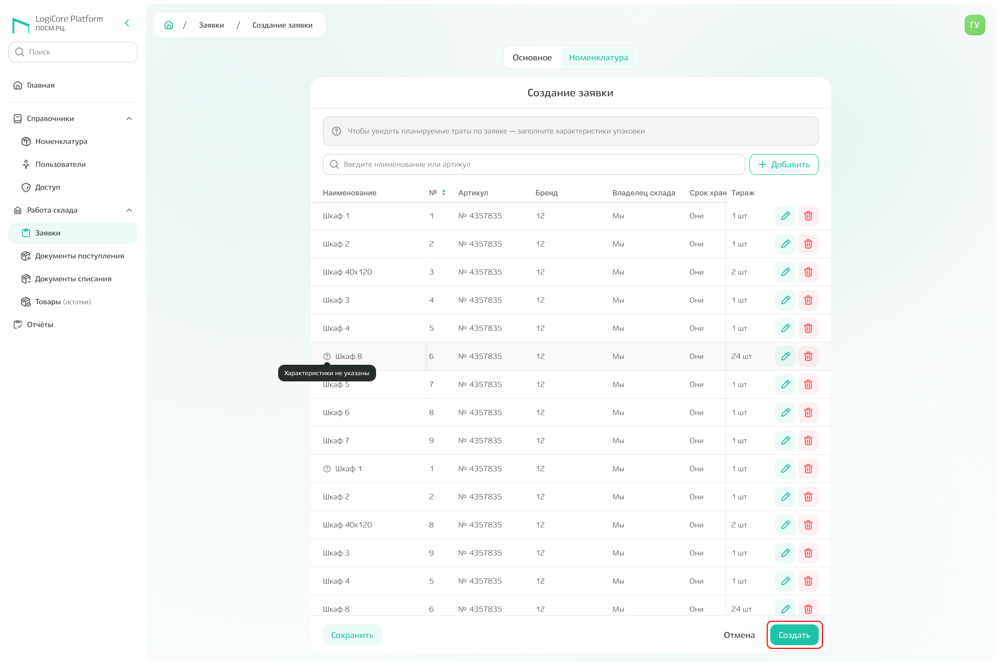{.center width=1200}

Нажмите «Создать». В реальном продукте заявка со статусом «Сохранено» меняет статус на «В работе» и отправляется на склад. В прототипе выводится уведомление об успешном создании.

#### Просмотр и редактирование заявок



Для возможности посмотреть функционал просмотра и редактирования снова нажмите на подсистему «Заявки» в боковом меню. Данное действие требуется только при работе с прототипом, в реальном продукте переоткрытие подсистемы заявок не требуется.



В подсистеме «Заявки» отображается список заявок в виде карточек. Набор заявок зависит от роли: аккаунт-менеджер видит только свои заявки, владелец бюджета — заявки в рамках своих поручений плюс свои, администратор — все заявки в системе.

У каждой заявки отражён статус:
- «Выполнена» означает, что все работы завершены;
- «В работе» — заявка отправлена на склад, работы ещё не закончены;
- «Сохранена» — это черновик, заявка ещё не отправлена, и это единственный статус, в котором можно что-то изменить;
- «Отменена» — работы не были выполнены.

При клике по карточке со статусом «Выполнена» открывается модальное окно с общей информацией, связанными документами, файлами, расхождениями (если есть) и таблицей фактически принятой на склад номенклатуры. 

Клик по наименованию или тиражу открывает карточку конкретного товара, команда «Номенклатура» увеличивает таблицу, а «×» закрывает окно.

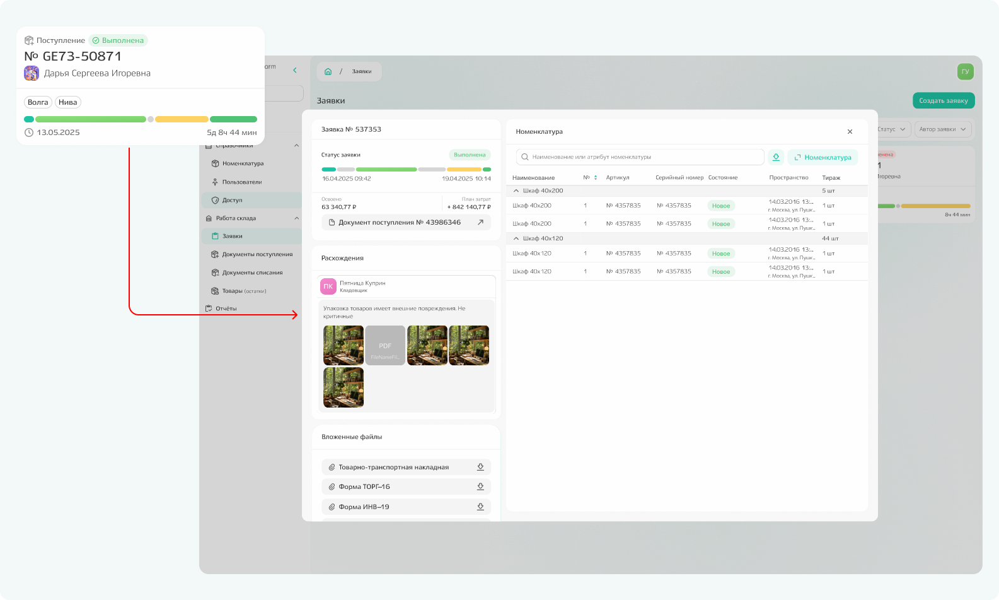{.center width=1200}

Карточка со статусом «Сохранена» открывается на том месте, где создание было остановлено. В прототипе отражена ситуация, когда создание заявки остановилось на моменте добавления номенклатуры в заявку.
Доступны команды
- «Добавить» для добавления номенклатуры — будет открыто модальное окно, которое в реальном продукте необходимо было бы заполнить, в прототипе имитировать добавление по команде «Добавить»;
- «Создать» для отправки заявки в работу и вкладка «Основное» для просмотра информации.

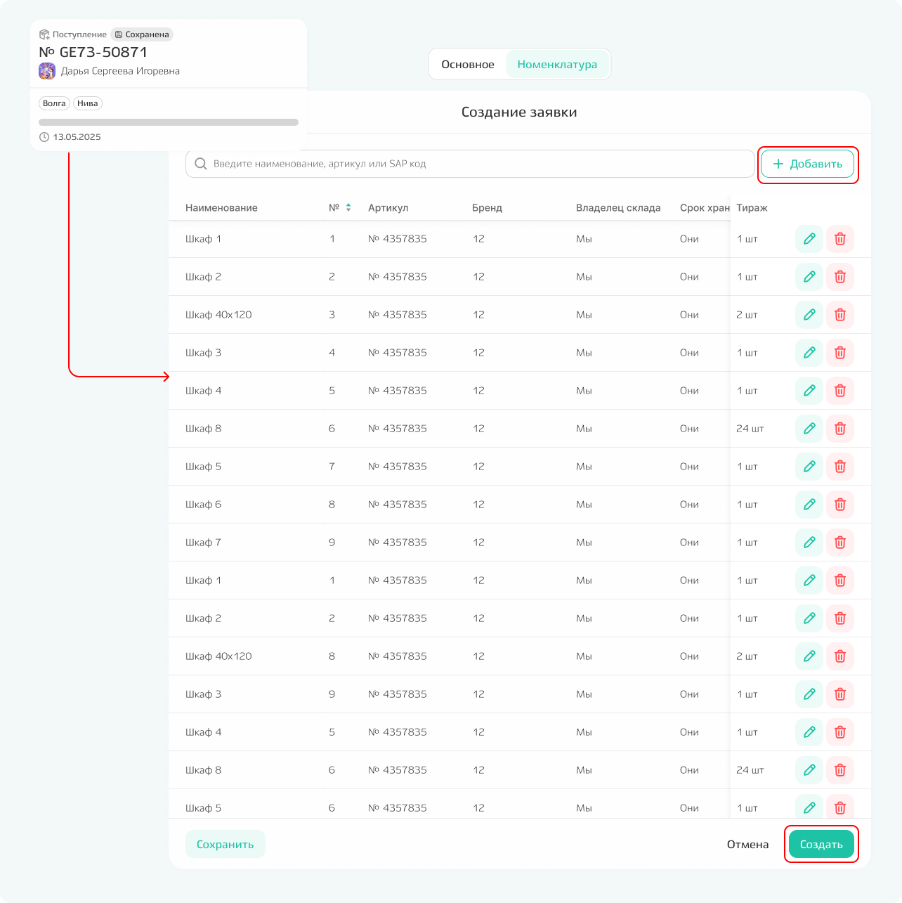{.center width=1200}

### 5. Документы поступления

**Доступ:** у аккаунт-менеджера, владельца бюджета и администратора

В подсистеме «Документы поступления» отражён список всех доступных для пользователя документов. 
Кликните по любой строке — откроется форма выбранного документа. 
*В прототипе для всех строк открывается одна и та же страница (ограничение прототипа).*

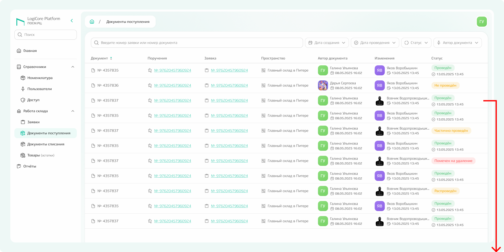{.center width=1200}

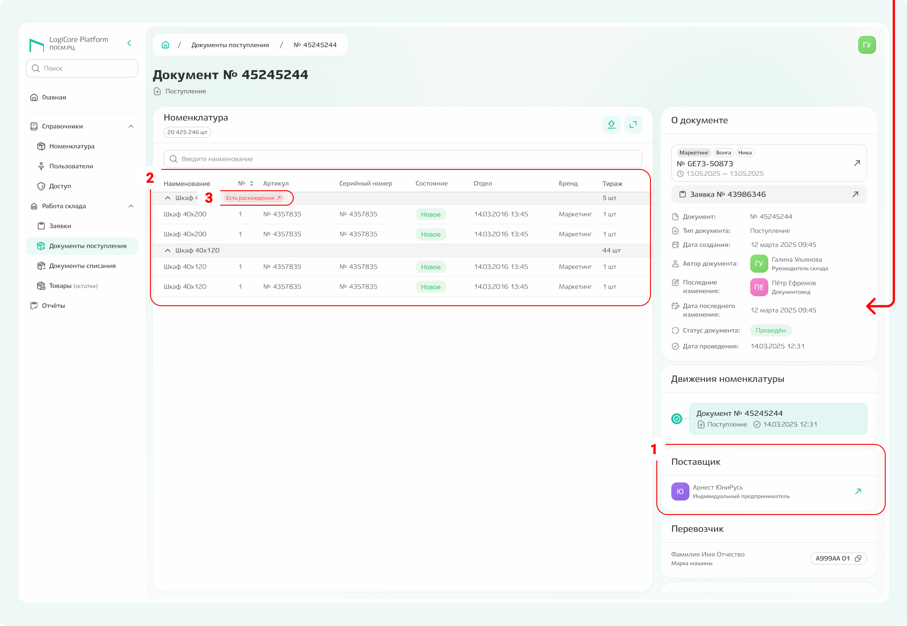{.center width=1200}

В окне с информацией о документе можно:
1. Посмотреть информацию о поставщике — кликните по карточке поставщика в сайдбаре справа.
2. Посмотреть карточку товара — кликните по наименованию или тиражу в списке пришедших товаров. Будет отражено модальное окно с информацией о пришедшем товаре, где можно кликнуть по вложенным файлам и движениям товара. 
В реальном продукте вложенные файлы можно будет скачать, а из движений товара перейти к конкретному документу складского движения. В прототипе это только графическое отображение, переходов нет. 
Карточка закрывается по «×» (может потребоваться несколько кликов — ограничение прототипа).
3. Посмотреть информацию о расхождениях — кликните по ссылке «Есть расхождения». Откроется таблица с плановыми данными из заявки. В самом документе отражена фактическая информация о поставке на склад.

### 6. Документы списания

**Доступ:** у аккаунт-менеджера, владельца бюджета и администратора

Отображение документов списания устроено так же, как в подсистеме «Документы поступления». Единственное отличие: в карточке документа отсутствует блок с расхождениями. Это соответствует бизнес-логике — списывается ровно столько, сколько фактически есть на складе.

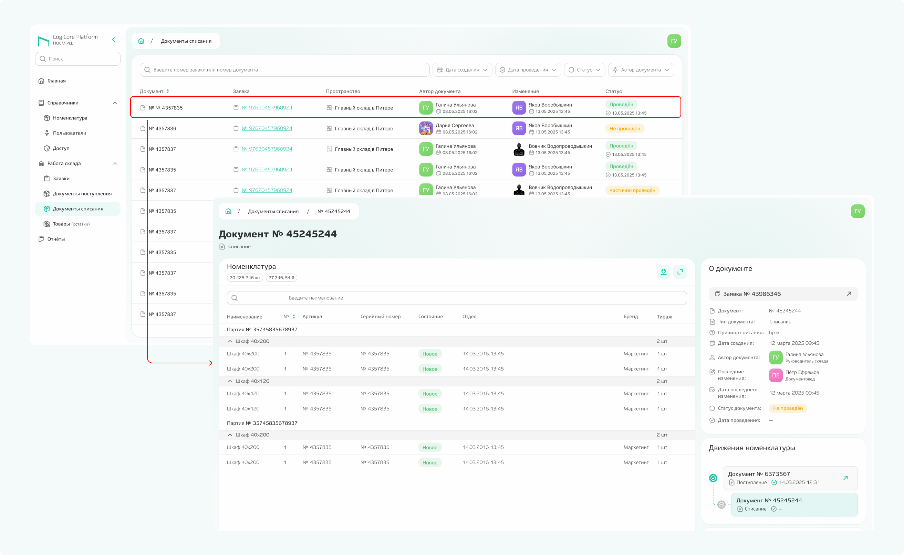{.center width=1200}

### 7. Товары

**Доступ:** у аккаунт-менеджера, владельца бюджета, администратора.

В подсистеме «Товары» отражены складские остатки. При клике по наименованию или тиражу открывается карточка товара — та же, что и при просмотре товара из документа списания.

Группировку товарных остатков можно настроить в свитчере. Доступны три режима: «Поштучно», «По партиям» или «По наименованию».

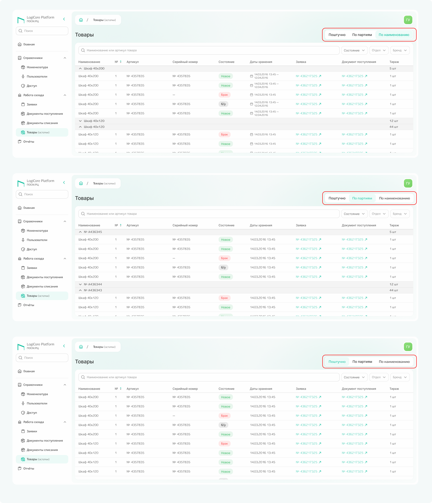{.center width=1200}

### 8. Отчёты

**Доступ:** у владельца бюджета и администратора.

В подсистеме «Отчёты» собраны ежедневные отчёты и биллинги (отчёты за месяц). По умолчанию в списке выбран последний сформированный отчёт, а в сайдбаре справа отражена информация о плановых затратах, созданных поручениях и заявках.

При клике по команде «Подробнее» открывается список карточек заявок, откуда можно перейти к модальному окну с подробной информацией.

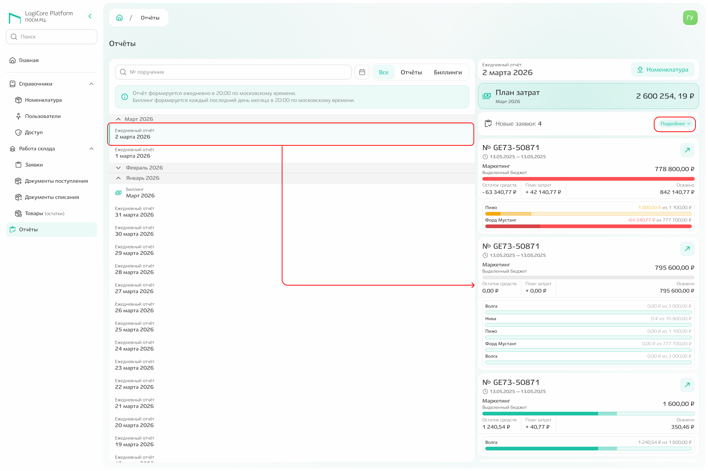{.center width=1200}

При выборе биллинга информация в сайдбаре меняется и показывает основные данные. 

По команде «Скачать биллинг» отображается сгенерированный PDF-файл.
В реальном продукте его можно скачать, в прототипе этот функционал не реализован. Чтобы закрыть окно с PDF-формой биллинга, кликните в любом месте прототипа.

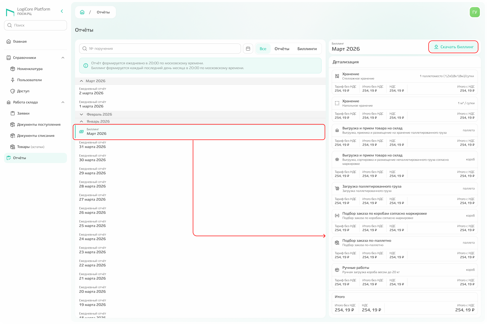{.center width=1200}

[1]: https://www.figma.com/proto/XizxvF7dcb5KLfk3ofVy4j/%D0%AE%D0%BD%D0%B8%D0%BB%D0%B5%D0%B2%D0%B5%D1%80?node-id=153-30158&p=f&t=1IHssR2KXpRVOBiC-0&scaling=min-zoom&content-scaling=fixed&page-id=0%3A1&starting-point-node-id=153%3A30158&show-proto-sidebar=1