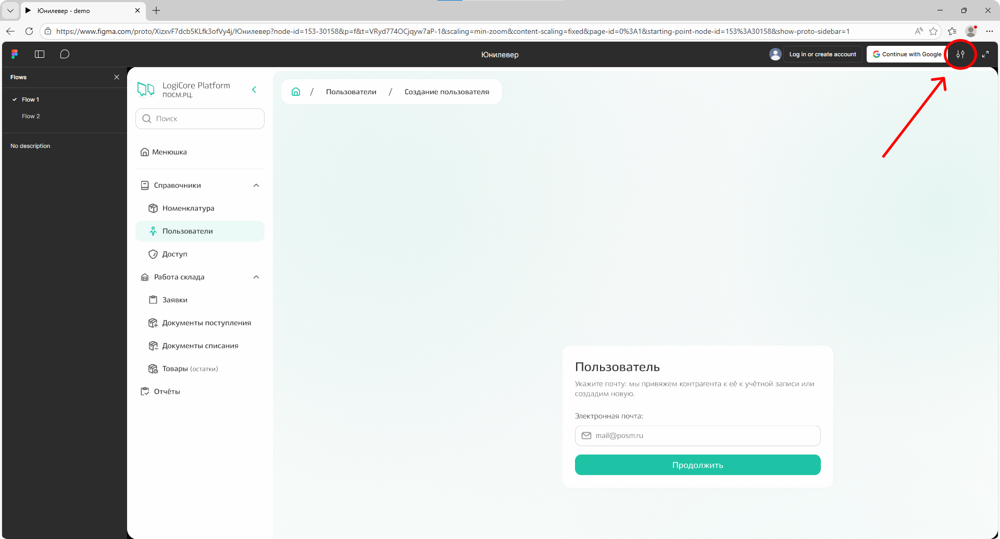
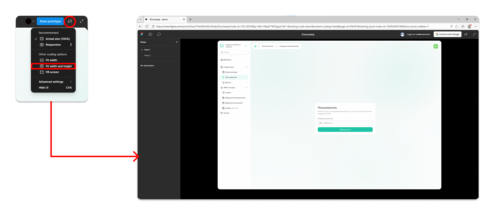
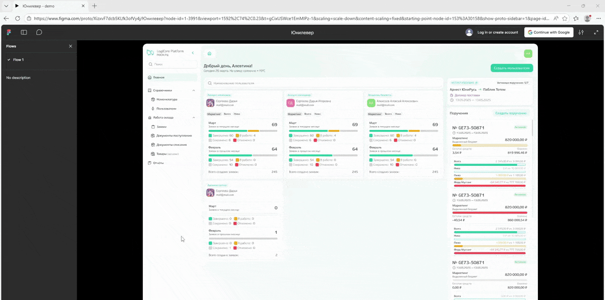
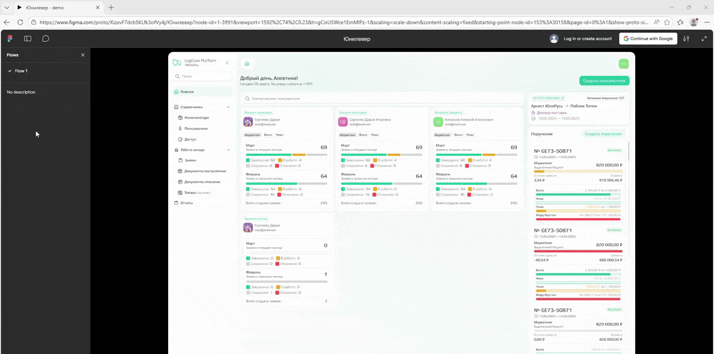
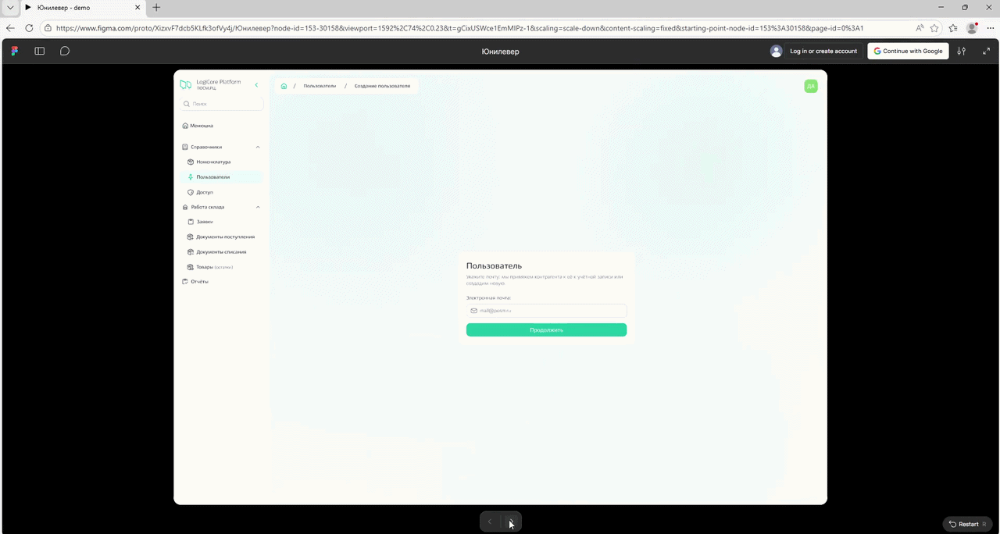
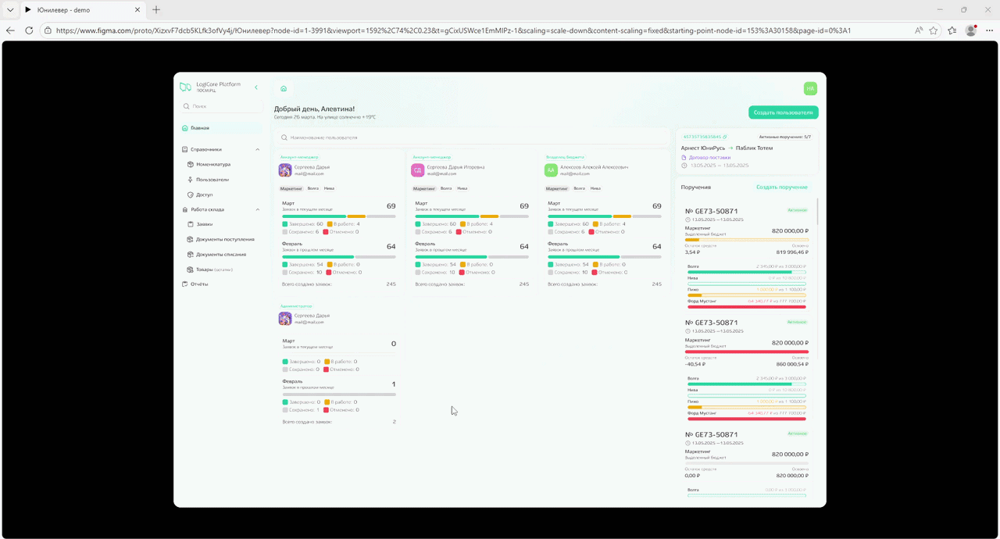

# Знакомство с функционалом демо-версии

Инструкция поможет вам познакомиться с будущим функционалом, который показан в [прототипе][1].



**Прототип в Figma — не рабочая версия продукта,** это иллюстрация того, как может быть отражена бизнес-логика. Прототип показывает, как будет выглядеть интерфейс, а также где, когда и после какого клика появляются страницы с определенной информацией. 



**В прототипе можно:** 
- познакомиться с экранами, окнами и навигацией в личном кабинете;
- увидеть, как меняется итнтерфейс в зависимости от роли;
- понять логику переходов между разделами.

**В прототипе нельзя:**
- вводить реальные данные;
- проверять скорость работы;
- проверять обработку ошибок и нештатных ситуаций. 

## Предварительная настройка

Перед началом работы настройте масштаб отображения и познакомьтесь с инструментами навигации в Figma.

### Масштаб

При открытии прототипа может не совпадать размер экранов с размером вашего монитора. Чтобы страница отображалась полностью, настройте масштаб:

1. **Найдите иконку настроек отображения** в Figma

{.center width=1200}

2. **Выберите опцию «Fit width and height»**

{.center width=1200}

### Подсказки

При работе с прототипом кликните по любому пустому месту в интерфейсе — система подсветит все активные элементы. Подсвеченные компоненты доступны для клика и приводят к изменениям на экране (открытие окон, переходы, смена данных).

Это поможет вам быстрее понять, куда можно нажимать, и не пропустить важные сценарии.

{.center width=1200}

### Навигация

Вы можете:

1. **Скрыть боковое меню:** здесь отражены варианты различных сценариев или флоу пользователя, которые иллюстрирует прототип. Мы работаем только в одном флоу, поэтому нет необходимости в отображении бокового меню.

{.center width=1200}

2. **Вернуться на шаг вперед или назад**: в специальном баре при клике по команде «<» будет осуществлен переход назад, при клике по «>» — на шаг вперед. 

{.center width=1200}

3. **Начать выполнение сценария заново**: по команде «Restart».

{.center width=1200}

## Ролевая модель

### Доступ к функционалу по ролям

К личному кабинету есть доступ у пользователей с тремя ролями:
- **аккаунт-менеджер** — базовый доступ: может работать с заявками, документами поступления и списания, товарами и номенклатурой;
- **владелец бюджета** — всё, что доступно аккаунт-менеджеру, а также создание поручений и просмотр отчётов;
- **администратор** — всё, что доступно владельцу бюджета, а также добавление пользователей и настройка доступа к системе, брендам и отделам. 



В прототипе представлен **интерфейс администратора** — как наиболее полный.
*Интерфейсные отличия для ролей «владелец бюджета» и «аккаунт-менеджер» описаны ниже.*  



Функционал распределён по подсистемам, которые находятся в боковом меню. При клике на «LogiCore Platform» состав бокового меню будет меняться и отображать список доступных подсистем разных ролей.

{.center width=1200}

### Главная страница

Интерфейс главной страницы зависит от роли пользователя. 

**Главная страница администратора** будет включать в себя:
1. список пользователей и их активность (рассчитывается относительно количества созданных и обработанных заявок);
2. информацию о действующем договоре; 
3. все созданные поручения.
*Каждый из элементов главной страницы кликабельный: можно протестировать в прототипе и и посмотреть детальную информацию по каждому элементу.* 

{.center width=1200}

**Главная страница владельца бюджета** будет включать в себя: 
1. поручения, созданные самим пользователем;
2. заявки, созданные в рамках этих поручений. 
*Главная страница владельца бюджета не реализована в прототипе, но аналогичный функционал рассмотрен для администратора*.

{.center width=1200}

**Главная страница аккаунт-менеджера** будет включать в себя:
1. заявки, созданные самим пользователем, с графическим отображением текущего этапа выполнения;
2. поручения, в рамках которых текущему пользователю можно создавать заявки. 
*Главная страница аккаунт-менеджера не реализована в прототипе, но аналогичный функционал рассмотрен для администратора*.

{.center width=1200}

## Главная страница

[1]: https://www.figma.com/proto/XizxvF7dcb5KLfk3ofVy4j/%D0%AE%D0%BD%D0%B8%D0%BB%D0%B5%D0%B2%D0%B5%D1%80?node-id=153-30158&p=f&t=1IHssR2KXpRVOBiC-0&scaling=min-zoom&content-scaling=fixed&page-id=0%3A1&starting-point-node-id=153%3A30158&show-proto-sidebar=1